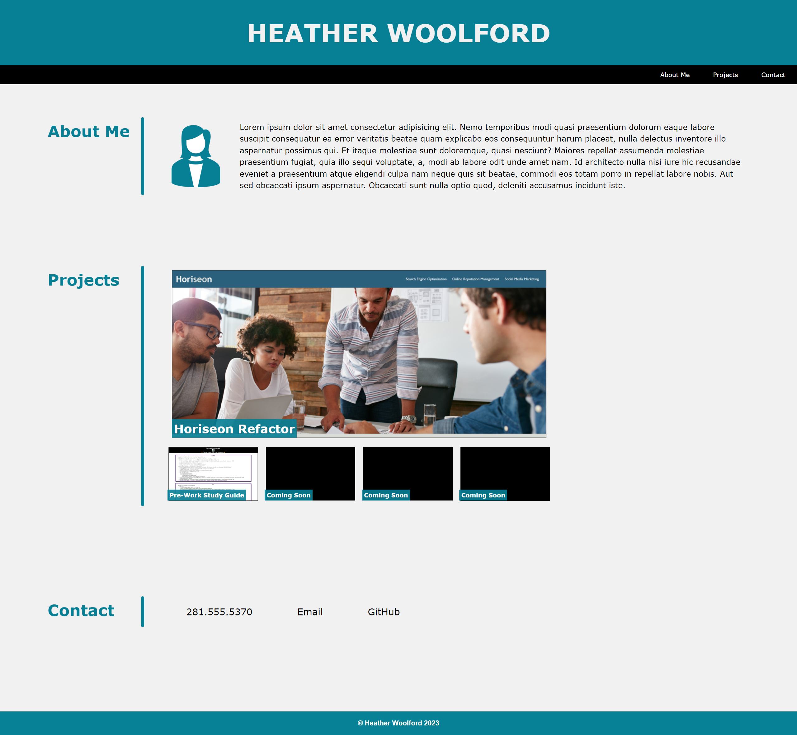
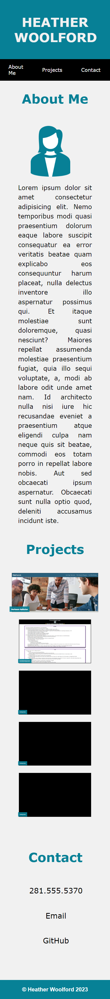

# Professional-Portfolio

## Description

This project is a responsive professional portfolio webpage utilizing HTML and CSS. 

### Visuals

View of the webpage on a desktop computer and cell phone

### Installation

1. Clone the repository to your machine
2. Copy the files to your own repository
3. Conduct the git add, commit, and push commands to update your repository with the copied files
4. Replace elements with your information and use the included CSS file to personalize the site to meet your needs
3. Commit and push your changes

### Usage

This website can be used to showcase your achievements to future employers.

### Links

- [Deployed Website](https://hwoolford.github.io/professional-portfolio/)
- [GitHub Repository](https://github.com/hwoolford/professional-portfolio/)